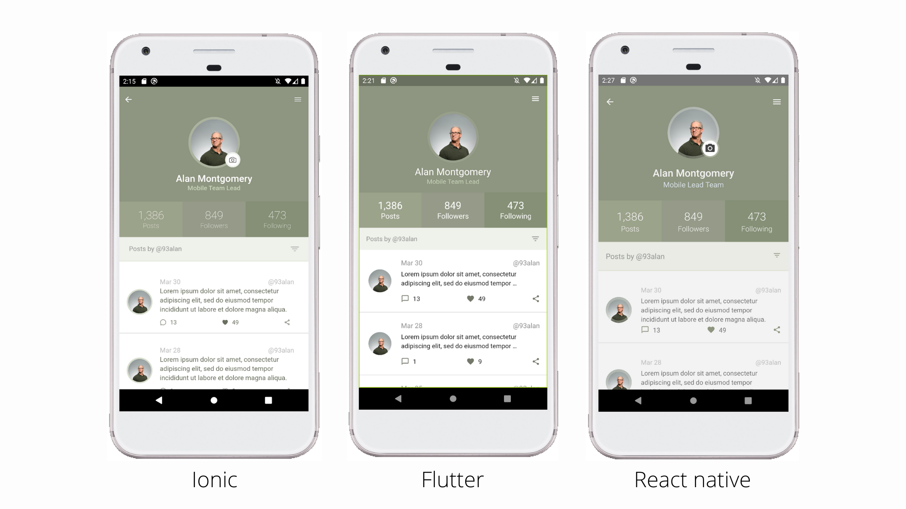

<p align="left" width="100%">
    
</p>


This project was generated using [Nx](https://nx.dev).

> **Nb.** I have not installed nx cli locally, just using `npx` only. So in this Readme doc I will explain like in my local machine.


Table of Contents
- [Setup NX Workspace](#setup-nx-workspace)
- [Setup Ionic React](#setup-ionic-react)
- [Setup Flutter](#setup-flutter)
- [Setup React Native](#setup-react-native)
- [Running Applications](#running-applications)
  - [Run Ionic App](#run-ionic-app)
  - [Run Flutter App](#run-flutter-app)
  - [Run React Native App](#run-react-native-app)


## Setup NX Workspace
If you wanna to initiate application similarly to these repository, you can following few steps below. If don't, you can skip to [Running Applications](#running-applications).

To start initiate workspace you can run the following command.

```bash
npx create-nx-workspace examples
```
- Then choose an `empty` workspace


## Setup Ionic React
Follow these commands to setup in ionic react.
```bash
yarn add @nxtend/ionic-react
yarn nx generate @nxtend/ionic-react:init
yarn nx g @nxtend/ionic-react:application profile-ionic
```

Or you can more explore in the [Nx Ionic React Documentation](https://nxtend.dev/docs/ionic-react/getting-started)


## Setup Flutter
Please to ensure, you have been installed flutter on your local machine!.
If don't please follow [this official guideline](https://flutter.dev/docs/get-started/install) to install it.

Then Follow these commands to setup in flutter.

```bash
yarn add @nxrocks/nx-flutter
yarn nx g @nxrocks/nx-flutter:create profile-flutter
```

You also can more explore at [Nx Flutter Documentation](https://github.com/tinesoft/nxrocks/tree/develop/packages/nx-flutter#nx-flutter)


## Setup React Native
Please to ensure, you have been installed React Native Environment on your local machine!
If don't please follow [the official guideline](https://reactnative.dev/docs/environment-setup) to setup it.

Then Follow these commands to setup in flutter
```bash
yarn add @nrwl/react-native
yarn nx g @nrwl/react-native:app profile-react-native
```

More details can read at [Nx React Native Documentation](https://github.com/nrwl/nx-react-native)


## Running Applications
To running these applications perfectly, you must installed anything environment needed as mentioned above.

Also, since we are building hybrid mobile application. Ensure, you have been installed Node.js correctly.

```bash
# Install all dependencies
yarn
```

### Run Ionic App
You can simply execute this command to run Ionic Application in your default browser.
```bash
yarn start:ionic
```

But, if you prefer to run it on your Android emulator, you can running this command:
```bash
yarn start:ionic-android
```
The command above will opened your Ionic Android codebase in you Android Studio. Then you can run it over there.


### Run Flutter App
You can run with command below or simply press either `F5` (Windows) or `fn+F5` (Mac) in your VSCode (runing your emulator first)
```bash
yarn start:flutter
```

### Run React Native App

```bash
# to run react native app in default browser
yarn start:rn-web

# To run react native app in android emulator
yarn start:rn-android

# To run react native app in XCode emulator
yarn start:rn-ios
```
